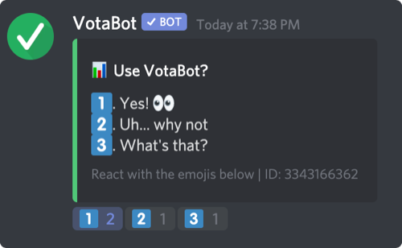

# ✅ VotaBot

A discord bot to create interactive simple polls easily.




## Use the bot

To use this bot type `!poll help` to see the commands availables. Be aware that **only administrators or users with
a role named "Poll Creator" can interact with the bot**. The "Poll Creator" role has to be created manually and does not
need any permisssion.  
You can also use `!poll examples` to see several examples of how to use the bot.

## Features

- Create polls up to 10 possible answers.
- Create timed polls up to a week.
- See the results of a poll as a percentage.
- Only allow certain users to interact with the bot.

## Host the bot

To host it create a file name "botconfig.json" or rename and edit "botconfig-sample.json" in the bot's folder. In this file must appear the token of the bot, the prefix ("!poll" by default) and, if wanted, a link to invite.

```json
{
	"token":"your token",
	"prefix":"!poll",
	"link":"the link to invite the bot (optional)"
}
```

Then in a command line in the bot's folder use `npm install`.

Now, to start the bot use `node index.js`.

I'm also hosting an instance of the bot you can invite it with this link:
<https://discordapp.com/api/oauth2/authorize?client_id=509451579678654468&permissions=68672&scope=bot>
